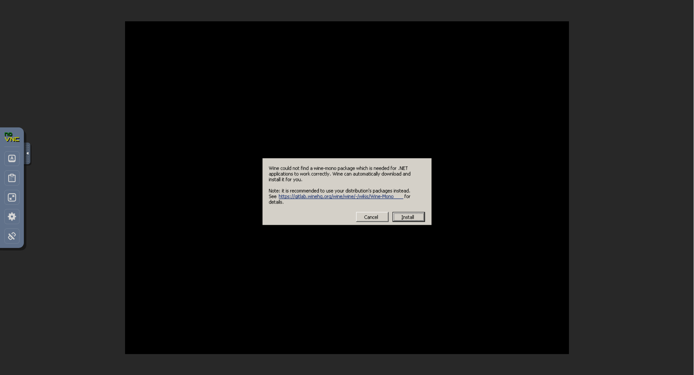
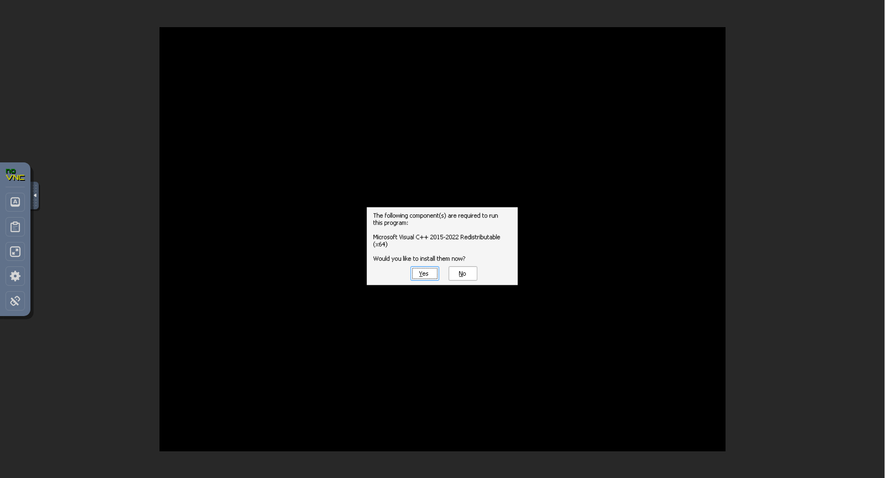

# Windrose Dedicated Server Docker

Linux x86_64 docker container for Windrose: https://playwindrose.com/dedicated-server-guide/

Uses wine to run the server on linux and web vnc to access the server ui for first time setup.

## How to use

### Build the docker image

```sh
docker build -t windrose-server-docker:latest .
```

### Run the server

```sh
docker run -d \
    --name windrose-server \
    -v ./windrose-data:/windrose \
    -v ./windrose-wine:/wine \
    -v ./windrose-wine-prefix:/wine-prefix \
    --restart unless-stopped \
    --stop-timeout 30 \
    localhost/windrose-server:latest
```

### Quadlet

You can install the quadlet to manage the server with systemd:

```sh
mkdir -p ~/.config/containers/systemd
cp ./quadlet/windrose-server.container ~/.config/containers/systemd/
systemctl --user daemon-reload
systemctl --user start windrose-server
```

The quadlet uses volumes by default to store the data.

### First time setup

The first time you boot up the server you need answer the ui prompts for installing mono and vcredist.

Once the container is up and running go to: http://localhost:8080/vnc.html and connect.



Press **Install** to confirm.



Press **Yes** to install vcredist.

The server should then start up. You won't need to do these steps again as long as the wine version stays the same.

### Environment variables

|Env var|Value|
|---|---|
|VNC_PORT|If you want to change the VNC port. (default: 5900)|
|WEB_PORT|If you want to change the VNC web port. (default: 8080)|
|WINE_URL|To change the wine version you wish to use to run the server. (default: https://github.com/Kron4ek/Wine-Builds/releases/download/11.6/wine-11.6-staging-amd64-wow64.tar.xz)|
|APP_ID|The dedicated server Steam app id. Most likely won't ever change. (default: 4129620)|
|UPDATE_ON_BOOT|If steamcmd should try to update the dedicated server on startup. (default: true)|

Example:

```sh
docker run -d \
    --name windrose-server \
    -v ./windrose-data:/windrose \
    -v ./windrose-wine:/wine \
    -v ./windrose-wine-prefix:/wine-prefix \
    -e VNC_PORT=5900 \
    -e WEB_PORT=8080 \
    -e WINE_URL=https://github.com/Kron4ek/Wine-Builds/releases/download/11.6/wine-11.6-staging-amd64-wow64.tar.xz \
    -e APP_ID=4129620 \
    -e UPDATE_ON_BOOT=false \
    --restart unless-stopped \
    --stop-timeout 30 \
    localhost/windrose-server-docker:latest
```
